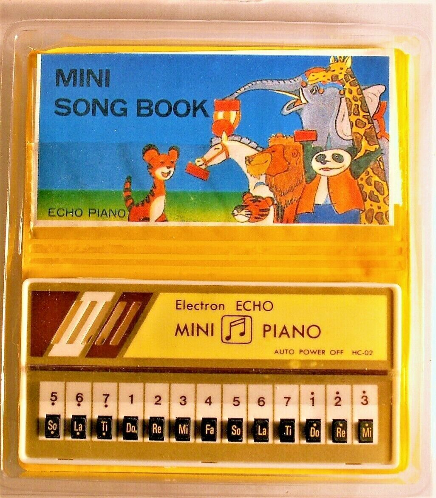
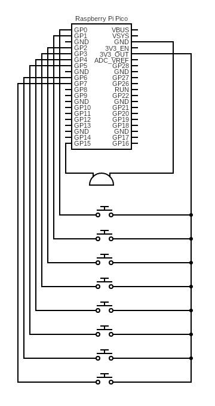

# Pico Piano

Inspired by the toy keyboards from my childhood a little electronic keyboard using a Raspberry Pi Pico.

## Parts

* Raspberry Pi Pico
* 8 switches
* 1 buzzer

## Wiring Diagram

## Code

Put the code from `main.py` onto the Pico board and voila your very own Mini Piano.